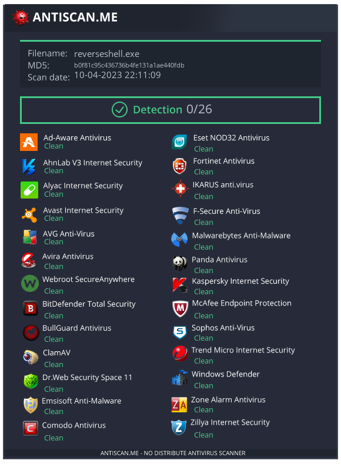

# Cross-Platform Reverse Shell in Dart

This is a simple cross-platform reverse shell implementation in Dart that can be used to connect to a remote shell and execute commands

## Detection screenshot

## Notes

- You should learn Dart is powerful and useful language
- This implementation currently supports only Windows, Linux, and macOS

- This implementation uses the Dart `Socket` and `Process` libraries to establish the reverse shell connection and execute commands on the remote machine

- This implementation is for educational purposes only and should not be used for any malicious purposes

- Use at your own risk
